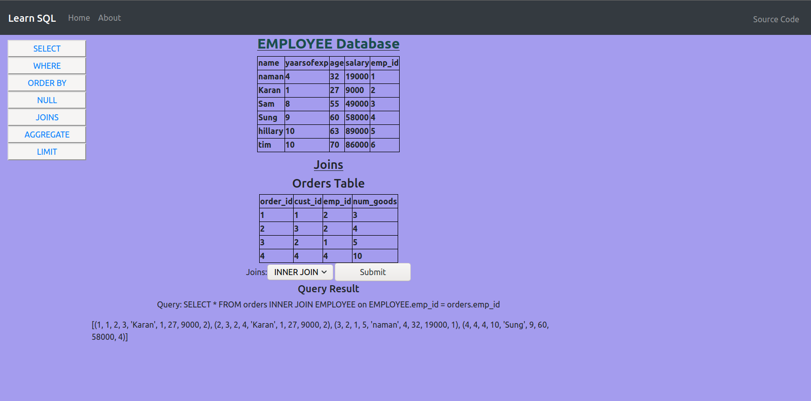
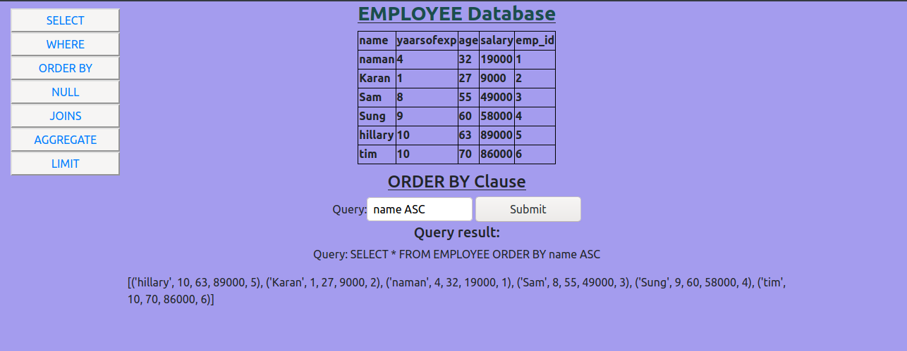
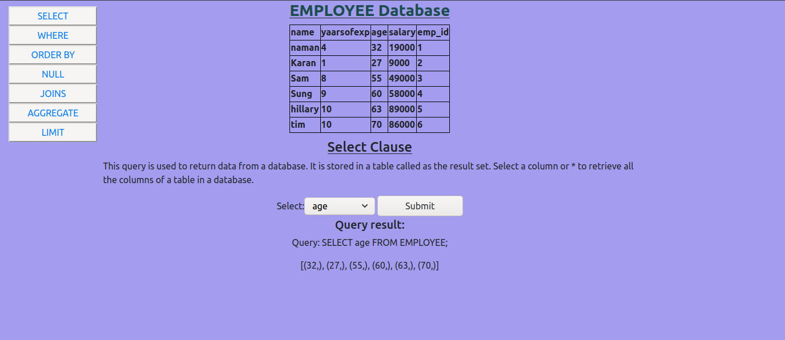
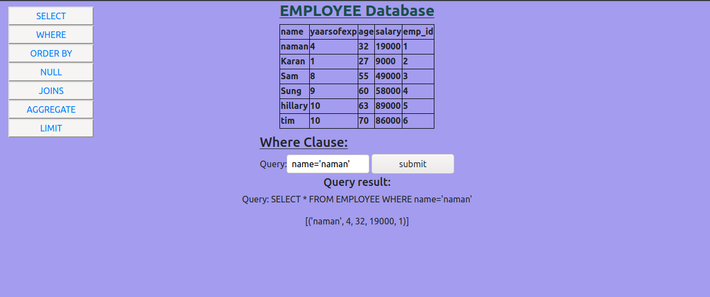

# my-app

## Table of Contents

- [About](#about)
- [Installing](#install)
- [Screenshots](#screenshots)
- [#TODO](#todo)

## About <a name = "about"></a>
Simple app to learn SQL query language 

## Installing <a name='install'></a>

Clone the repository
```
git clone https://github.com/shadyskies/sql_visualizer.git
```
Install requirements.txt
```
pip3 install requirements.txt
```
## Screenshots <a name='screenshots'></a>





## Usage <a name = "usage"></a>
```
cd sql_visualizer/
```
```
python3 manage.py runserver
```

## TODO <a name='todo'></a>
- cleanup views.py
- implement further functions